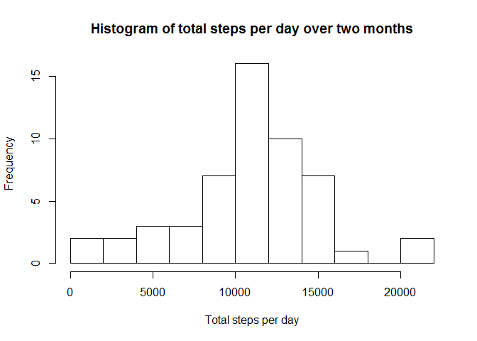
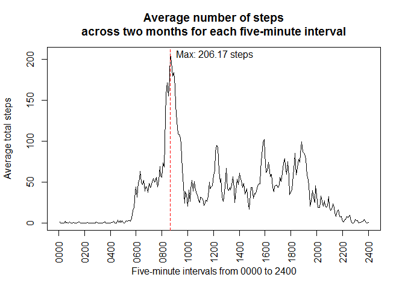
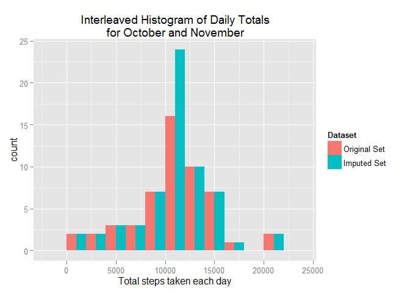
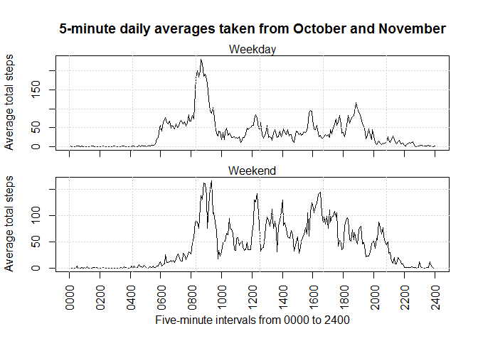

# Reproducible Research: Peer Assessment 1

## Loading and preprocessing the data
1. Load the data (i.e. read.csv())
2. Process/transform the data (if necessary) into a format suitable for your analysis


```r
# Read csv data from local zip file.
act = read.csv(unz("activity.zip", "activity.csv"))
# Format the interval time to a four-digit number string.
act$interval = formatC(act$interval, width=4, flag="0")
# Convert strings in "date"" column to date objects.
act$date = as.Date(as.character(act$date))
```

## What is mean total number of steps taken per day?
1. Calculate the total number of steps taken per day
2. If you do not understand the difference between a histogram and a barplot, research the      difference between them. Make a histogram of the total number of steps taken each day
3. Calculate and report the mean and median of the total number of steps taken per day


```r
# Get subset of complete cases.
act.cc = act[complete.cases(act),]
# Sum each days total steps.
act.cc.sum = sapply(split(act.cc$steps, act.cc$date), sum)
# Display histogram of total steps per day.
hist(act.cc.sum, breaks=10,
     main="Histogram of total steps per day over two months",
     xlab="Total steps per day")
```

 

```r
# Calculate the mean and median
act.mean = mean(act.cc.sum)
act.median = median(act.cc.sum)
paste ("mean:", act.mean)
```

```
## [1] "mean: 10766.1886792453"
```

```r
paste ("median:", act.median)
```

```
## [1] "median: 10765"
```

## What is the average daily activity pattern?
1. Make a time series plot (i.e. type = "l") of the 5-minute interval (x-axis) and the average number of steps taken, averaged across all days (y-axis)
2. Which 5-minute interval, on average across all the days in the dataset, contains the maximum number of steps?


```r
act.cc.ave = sapply(split(act.cc$steps, act.cc$interval), mean)
plot(act.cc.ave, type = "l", xaxt="n", 
     main="Average number of steps\nacross two months for each five-minute interval",
     ylab="Average total steps",
     xlab="Five-minute intervals from 0000 to 2400")
# Place 2-hour ticks along x-axis.
axis(1, at=seq(0, length(act.cc.ave), by=24), labels=formatC(seq(0,2400,by=200), width=4, flag="0"), las=2)
max.index = which.max(act.cc.ave)
max.xtick = names(max.index)
abline(v=max.index, col="red", lty=2)
text(max.index, act.cc.ave[max.index], paste0("Max: ", formatC(act.cc.ave[max.index], digits=5), " steps"), pos=4)
```

 

## Imputing missing values
1. Calculate and report the total number of missing values in the dataset (i.e. the total number of rows with NAs)
2. Devise a strategy for filling in all of the missing values in the dataset. The strategy does not need to be sophisticated. For example, you could use the mean/median for that day, or the mean for that 5-minute interval, etc.
3. Create a new dataset that is equal to the original dataset but with the missing data filled in.
4. Make a histogram of the total number of steps taken each day and Calculate and report the mean and median total number of steps taken per day. Do these values differ from the estimates from the first part of the assignment? What is the impact of imputing missing data on the estimates of the total daily number of steps?


```r
NA.rows = is.na(act$steps)
total.na = sum(NA.rows)
```
#### There are 2304 missing values in the dataset.
#### The next bit of code replaces missing values (NA steps) with the 2-month averages found in the previous section.

```r
# Copy data frame to create imputed dataset.
act.imp = act
# Replace NA values with the interval average from the previous section.
rep.times = length(act$steps) / length(act.cc.ave)  #17568 / 288 = 61
act.imp[NA.rows,"steps"] = rep(act.cc.ave, times=rep.times)[NA.rows]
```
#### The new dataset with imputed values:

```
##       steps       date interval
## 1 1.7169811 2012-10-01     0000
## 2 0.3396226 2012-10-01     0005
## 3 0.1320755 2012-10-01     0010
## 4 0.1509434 2012-10-01     0015
## 5 0.0754717 2012-10-01     0020
## 6 2.0943396 2012-10-01     0025
```


```r
library(ggplot2)
# Sum each days total steps.
act.imp.sum = sapply(split(act.imp$steps, act.imp$date), sum)
# Bind the original and imputed sets for plotting.
df.cc = data.frame(ave.steps=act.cc.sum, Dataset="Original Set", row.names=NULL)
df.imp = data.frame(ave.steps=act.imp.sum, Dataset="Imputed Set", row.names=NULL)
df = rbind(df.cc, df.imp)
# Plot an interleaved histogram.
gg = ggplot(df, aes(x=ave.steps, fill=Dataset)) + geom_histogram(binwidth=2000, position="dodge")
gg = gg + ggtitle("Interleaved Histogram of Daily Totals\nfor October and November")
gg = gg + xlab("Total steps taken each day")
print(gg)
```

 

```r
# Calculate the mean and median
act.imp.mean = mean(act.imp.sum)
act.imp.median = median(act.imp.sum)

paste("mean:", act.imp.mean)
```

```
## [1] "mean: 10766.1886792453"
```

```r
paste("median:", act.imp.median)
```

```
## [1] "median: 10766.1886792453"
```

```r
paste("means difference:", act.imp.mean-act.mean)
```

```
## [1] "means difference: 0"
```

```r
paste("medians difference:", act.imp.median-act.median)
```

```
## [1] "medians difference: 1.1886792452824"
```


#### The *mean* and *median* total number of steps taken per day remains the same after imputing the dataset. They are 1.0766189\times 10^{4} and 1.0766189\times 10^{4} respectively. 
#### On the otherhand, the count of the daily totals is different. Because the NA data was filled with the *daily means*, the count of the mean total is higher for the imputed dataset as seen in the graph.

## Are there differences in activity patterns between weekdays and weekends?
1. Create a new factor variable in the dataset with two levels -- "weekday" and "weekend" indicating whether a given date is a weekday or weekend day.
2. Make a panel plot containing a time series plot (i.e. type = "l") of the 5-minute interval (x-axis) and the average number of steps taken, averaged across all weekday days or weekend days (y-axis).


```r
# Add a weekday/weekend factor column to dataset.
days = weekdays(act.imp$date)
weekend = c("Saturday", "Sunday")
act.imp$week___ = factor(days %in% weekend, labels=c("weekday", "weekend"))
str(act.imp)
```

```
## 'data.frame':	17568 obs. of  4 variables:
##  $ steps   : num  1.717 0.3396 0.1321 0.1509 0.0755 ...
##  $ date    : Date, format: "2012-10-01" "2012-10-01" ...
##  $ interval: chr  "0000" "0005" "0010" "0015" ...
##  $ week___ : Factor w/ 2 levels "weekday","weekend": 1 1 1 1 1 1 1 1 1 1 ...
```

```r
# Split the data into weekday and weekend groups and find 5-minute averages for each.
split.act = split(act.imp, act.imp$week___)
df = data.frame(sapply(split.act, function(x) sapply(split(x$steps, x$interval), mean)))

# Plot the results side-by-side.
# Plot 'weekday' data
par(mfrow=c(2,1), mar=c(1.5,4.1,4.1,2.1))
plot(df$weekday, type="l", xaxt="n", 
     main="5-minute daily averages taken from October and November",
     ylab="Average total steps")
mtext("Weekday")
axis(1, at=seq(0, length(act.cc.ave), by=24), labels=rep("", times=13), las=2)
grid()
# Plot 'weekend' data
par(mar=c(5.1,4.1,0.5,2.1))
plot(df$weekend, type="l", xaxt="n", 
     ylab="Average total steps",
     xlab="Five-minute intervals from 0000 to 2400")
mtext("Weekend")
axis(1, at=seq(0, length(act.cc.ave), by=24), labels=formatC(seq(0,2400,by=200), width=4, flag="0"), las=2)
grid()
```

 

#### The plot above shows the differences in weekday and weekend activity. Both graphs peak between 8 and 10 a.m. but also shows that the individual is relatively more active through the day on weekends.
